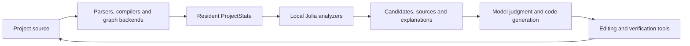

# ShenScope

**A general coding agent built in Julia, with project relationships, programmable analysis and code editing in one runtime.**

[简体中文](README.md) · English

ShenScope works with Python, JavaScript/TypeScript, Go, C/C++ and other codebases.
Use it to investigate failures, understand dependencies, assess changes, write code and run tests.
Julia implements the Agent Core; your project can use any language.

The main design is simple: **keep project data resident, compute relationships and filters locally,
and use models for understanding, generation and engineering judgment.** Symbols, call relationships,
source versions and analysis results are available within the same Julia runtime.
For project-specific questions, you can add an analyzer, validate it and save it for reuse.

*Born in Shenzhen. Built with Julia.*

## Keep project knowledge in memory

After indexing, `ProjectState` retains file facts, symbols, relationships and forward/reverse
adjacency indexes. Queries reuse that data. Saved-file watching and incremental updates maintain
the affected facts and relationships. Persistent caches can be loaded when returning to a project.

For example, before changing a public interface, follow reverse call relationships to find
affected code, select candidate tests, and inspect Git cochange history for related files.
The model receives candidates with sources and explanations. Ordinary Julia functions perform
graph traversal, filtering and ranking locally, with explicit limits on traversal and output.

Source hashes, backend versions and index revisions identify the code an analysis describes.
Incremental updates have checks against full rebuilds. Backend extraction and update costs
are recorded separately.

See [project data](docs/core/project_data.md), [impact and migration](docs/core/migration.md)
and [Git history](docs/core/git_history.md).

## Change the graph backend, keep the analyzer

Backends supply facts, analyzers compute, and models make decisions. Each has its own interface.



CodeGraphContext is integrated through its actual SDK and Ladybug graph storage. Its private
structures stay inside the adapter. Analyzers use ShenScope's symbol, relationship and location
model, allowing the same impact and test-candidate analyses to use Go AST, Tree-sitter or
CodeGraph data.

| Data source | Current use |
|---|---|
| Go AST | Go's native parser extracts declarations, imports and candidate calls |
| Tree-sitter | Multilingual syntax, declarations and relationships |
| CodeGraphContext | Code graph facts converted into Core's common model |
| TypeScript compiler | JS/TS types, definitions, references, calls, implementations and diagnostics |
| JuliaSyntax | Julia syntax and additional Julia-project support |
| External LSP | Explicitly configured servers provide navigation, completions, signatures and call hierarchy according to their capabilities |

Saved facts from several backends can also be queried together. Each source retains its identity
and observations. Matching locations on identical source establish correspondence; disagreements
remain visible. Syntax candidates, compiler semantics and runtime evidence retain their own meanings.

See [combined evidence](docs/core/combined_evidence.md), [TypeScript semantics](docs/core/semantic.md)
and [language services](docs/core/language_services.md). Go AST candidate calls currently lack
Go type-checker confirmation. External LSP synchronizes disk source; unsaved editor-buffer
synchronization remains unfinished.

## Write analysis methods for your project

Built-in analyzers cover impact, candidate tests, Git cochange, architecture, migration order
and risk candidates. For your own layering rules or dependency constraints, write an ordinary
Julia analysis function, or ask a model to propose one and run it through the same validation process.

Temporary analyzers implement `analyze(data, request)::Dict` and `selftest()::Bool`.
Core sends selected project facts to a separate process, checks external fixtures and the
symbol/relationship references in its results, then returns candidates, scores, explanations
and evidence. Project-specific questions such as cross-layer calls or dependencies affected by
a public-interface change can use a separate analyzer without adding its algorithm to Agent Core.

An analyzer belongs to the current conversation by default. Useful methods can be archived by
content hash and selected as a project- or user-scoped active version after validation. Promotion
and rollback rerun external fixtures and check version conditions. Analysis methods and model
judgment can therefore be improved separately.

Julia supplies ordinary functions, dynamic loading and JIT compilation in the same environment.
`invokelatest` handles calls to newly defined methods; archives and active pointers manage versions.
Generated code executes in a separate process. Linux x86_64 has verified seccomp restrictions
against file opens, network access and child-process creation, with time and output limits.
Isolation on other platforms remains unfinished.

See [isolated analyzers and their lifecycle](docs/core/isolated_analyzers.md).

## Extend Core with Julia types and methods

Provider, Tool, ProjectDataBackend and Analyzer interfaces use Julia multiple dispatch.
An extension package defines its types and implements the required methods; Core checks and
activates its contributions. Installed independent Julia packages can be loaded after name,
UUID, version and source-hash checks. Julia `weakdeps` and package extensions enable optional capabilities.

The running Core can inspect actual method signatures, missing interfaces and dispatch ambiguities.
Custom model services, internal code indexes and specialized tools get runtime evidence of
whether their interfaces are complete or their methods conflict. Failed activation quarantines
an extension. Deactivation stops new calls before waiting for existing calls to finish.

| Julia mechanism | Use in ShenScope |
|---|---|
| Multiple dispatch and type parameters | Different data and execution implementations for providers, tools, backends and analyzers |
| Method reflection and ambiguity checks | Inspect extension contracts, missing methods and conflicts |
| `Module` and `invokelatest` | Organize loaded code and call new methods at explicit boundaries |
| `weakdeps` and package extensions | Load optional capabilities; an actual SparseArrays evidence-matrix extension is available |
| `Task`, `Channel` and `ScopedValue` | Coordinate model streams, tools and background work with shared permissions, budgets and cancellation |
| FFI, processes and IO | Use native parsers, external language tools and existing ecosystems |

Trusted extensions run within the Core process and have a different trust scope from isolated
analyzers. Deactivation manages calls and resources; it does not unload Julia methods.
See [Julia extensions](docs/core/julia_extension_lifecycle.md) and
[runtime interface inspection](docs/core/julia_diagnostics.md).

## Core can inspect its own computation

ShenScope can inspect actual compiled results for supported Core functions, including inferred
types, IR, allocations and sampled stacks. When developing an analyzer or optimizing graph
computation, you can examine both the result and where the computation spends resources.
Compiler locations, allocation samples and periodic samples can be associated with
source-hashed Julia declarations while retaining their separate provenance.

These diagnostics currently target fixed Core functions. Python, Go, C++ and other user projects
use their corresponding parsers, language services, tests and check commands. Core self-inspection
and project-language support are separate capabilities.

See [compiler IR](docs/core/compiler_ir.md), [allocation and timing](docs/core/runtime_profiling.md),
[periodic sampling](docs/core/runtime_sampling.md) and [source/runtime evidence](docs/core/runtime_evidence.md).
Precompilation and PackageCompiler runtime images have an experimental workflow. Standalone
application distribution remains unfinished; see [runtime images](docs/core/runtime_images.md).

## Coding workflows

These analysis capabilities work alongside the agent's everyday tools.

| Capability | Current implementation |
|---|---|
| Model services | OpenAI Chat / Responses, Anthropic, Gemini and Ollama; streaming, native reasoning, budgets, routing and retries before delivery |
| Planning and context | Plan/Act, editable task plans, trimming/summaries and retained original tool outputs |
| File changes | Search/read/hash checks; multi-file proposals, diffs, explicit application, conflict checks and failure rollback |
| Tests and checks | Argument-vector commands for any language; discovery, execution, cancellation, output receipts and source-associated diagnostics |
| Longer work | Conversations/branches, versioned memory, persistent task dependencies, leases and result receipts |
| External capabilities | MCP stdio / Streamable HTTP, project/user Skills and lifecycle Hooks |
| Permissions | Separate Allow / Ask / Deny policies for read, edit, process, network, MCP, dynamic code and persistence |

Edit proposals record observed source versions and recheck them before application. Selected
test receipts can be associated with a proposal. Saved history restores as a new proposal for
review; existing execution results can be queried. Language-server formatting, rename and
code actions can also become reviewable edit proposals.

See [edit workflows](docs/core/workspace_edits.md), [project testing](docs/core/project_testing.md),
[check diagnostics](docs/core/project_validation.md), [models](docs/core/models.md),
[context](docs/core/context.md), [memory](docs/core/memory.md), [tasks](docs/core/tasks.md),
[MCP](docs/core/mcp.md), [Skills](docs/core/skills.md) and [Hooks](docs/core/hooks.md).

## Four interfaces

| Interface | Use and status |
|---|---|
| CLI | Start tasks, query project data and run analyses in a terminal |
| TUI | Interactive terminal conversations, tool progress and approvals |
| VS Code extension | Standalone VSIX for an existing VS Code installation; Julia and dependencies currently require separate installation |
| ShenScope IDE | Standalone development IDE based on Code-OSS; its integrated ShenScope sidebar can start Core with extensions disabled |

All four interfaces use the same Julia Core contracts. Core owns the agent, models, configuration,
conversations, permissions and analysis. Editors handle interaction and display. The native IDE
and VSIX share a panel and have Terminal and Testing integration. Some newer features are
available through Core tools/RPC without a dedicated graphical page.

**A complete, directly installable ShenScope IDE package has not been released yet.**
The native IDE can run through the source-build workflow. Installers, bundled Julia, upgrades
and uninstall support remain unfinished. The VSIX is a separate extension package.
See the [extension guide](editors/vscode/README.md) and [IDE build guide](ide/README.md).

## Getting started

### CLI / TUI

Install Julia 1.11. These examples use a Linux/Unix shell:

```sh
git clone https://github.com/SurviveAIEra/ShenScope.git
cd ShenScope
export SHENSCOPE_JULIA="$(command -v julia)"
julia --project=. -e 'using Pkg; Pkg.instantiate(); Pkg.precompile()'
bin/shenscope --help
bin/shenscope doctor --root /path/to/project --state-dir .local/state
```

Configure your model service in a TOML file, for example:

```toml
[provider]
protocol = "openai_chat"
name = "my-service"
endpoint = "https://api.openai.com/v1"
model = "gpt-4.1"
key_env = "SHENSCOPE_MODEL_KEY"

[permissions]
read = "allow"
edit = "ask"
process = "ask"
network = "ask"
mcp = "ask"
dynamic = "ask"
persistence = "ask"
```

Use your service's address and model name. Supply keys through the environment or editor secure
storage; configuration stores only the variable name.

```sh
bin/shenscope chat "Investigate the failure and propose a repair" \
  --root /path/to/project --config /path/to/shenscope.toml --agent-mode plan
bin/shenscope tui --root /path/to/project --config /path/to/shenscope.toml
```

### VS Code extension

Building the VSIX from source requires Node.js and npm:

```sh
npm --prefix editors ci --ignore-scripts --no-audit --no-fund
npm --prefix editors run check
npm --prefix editors run build
python scripts/package_vsix.py
code --install-extension dist/shenscope-0.1.0.vsix
```

Open the ShenScope sidebar in a trusted local workspace. Set `shenscope.juliaPath` to the Julia
executable; `shenscope.corePath` can select an existing Core checkout. When using the packaged
Core, first install dependencies for its `core/Project.toml`; see the
[extension guide](editors/vscode/README.md).

## Open-source references

ShenScope studies behavior, architecture, protocols and failure handling across the following
projects, with Agent Core independently implemented in Julia. Research records identify inspected
source and revisions. Licenses and actual dependencies are documented separately.

| Primary reference | Design areas studied |
|---|---|
| [Codex](https://github.com/openai/codex) | Request/execution boundaries, approvals, cancellation, app-server and terminal interaction |
| [DeepSeek Harness](https://github.com/deepseek-ai/deepseek-harness) | Events/durable state, scheduling, exclusive barriers, tasks and message lifecycles |
| [OpenCode](https://github.com/anomalyco/opencode) | Model adapters, compaction, conversations, MCP/LSP and client/server responsibilities |
| [Pi](https://github.com/badlogic/pi-mono) | Original messages/model context, steering, branches, Skills and extension interfaces |
| [Kimi Code](https://github.com/MoonshotAI/kimi-code) | Native reasoning, request guards, trust/cancellation, plugins and TUI |
| [ZCode](https://github.com/zai-org/ZCode) | Turn state, steering/queues, compaction state and CLI/desktop workflows |
| [Qwen Code](https://github.com/QwenLM/qwen-code) | Providers, Plan/Act, MCP/Hooks/Skills/LSP and CLI/IDE/SDK |

Additional research by purpose:

- **Project understanding and editing:** [Aider](https://github.com/Aider-AI/aider), [Serena](https://github.com/oraios/serena) and [CodeGraphContext](https://github.com/CodeGraphContext/CodeGraphContext): repository maps, semantic navigation, edit feedback and graph facts. CodeGraphContext is also an actual backend.
- **Execution and desktop workflows:** [Cline](https://github.com/cline/cline), [OpenHands](https://github.com/All-Hands-AI/OpenHands), [Software Agent SDK](https://github.com/OpenHands/software-agent-sdk), [Hermes Agent](https://github.com/NousResearch/hermes-agent) and [Goose](https://github.com/block/goose): approvals, execution environments, longer tasks and tool lifecycles.
- **Resident computation and Julia:** [Aries CLI](https://github.com/aayoawoyemi/Aries-cli), [AgentREPL.jl](https://github.com/samtalki/AgentREPL.jl), [JuliaMCP.jl](https://github.com/julia-vscode/JuliaMCP.jl), [Kaimon.jl](https://github.com/kahliburke/Kaimon.jl) and [PromptingTools.jl](https://github.com/svilupp/PromptingTools.jl): resident processes, runtime observation, model interfaces and dynamic capabilities.
- **Editors and distribution:** [Code-OSS](https://github.com/microsoft/vscode), [VSCodium](https://github.com/VSCodium/vscodium) and [PackageCompiler.jl](https://github.com/JuliaLang/PackageCompiler.jl): Workbench integration, Open VSX, branding/distribution and Julia runtime images.

See the [capability matrix](docs/architecture/capability_matrix.md),
[source research](docs/architecture/reference_synthesis.md) and
[reference revisions](docs/architecture/reference_lockfile.json).

## Development and validation

Core source lives in `src/`, CLI/TUI in `src/CLI/`, and optional Julia extensions in `ext/`.
`editors/` contains the shared panel and VSIX; `ide/` contains native editor integration.
See [module guides](docs/core/) and [validation records](docs/validation/).

```sh
julia --startup-file=no --threads=4 --project=. test/runtests.jl
npm --prefix editors run check
npm --prefix editors test
```

Server, parser, compiler and GUI checks require their corresponding dependencies; module guides
describe installation. The project is still in development. Live-model task quality, large-codebase
performance and complete cross-platform distribution remain to be verified.

## License

Authored ShenScope source uses [Apache-2.0](LICENSE). Dependencies retain their own licenses;
see [third-party notices](THIRD_PARTY_NOTICES.md).
