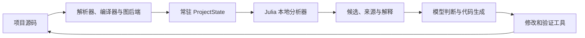

# ShenScope

**用 Julia 构建的通用编程 Agent，把项目关系、可编程分析和代码修改放在同一个运行时中。**

简体中文 · [English](README.en.md)

ShenScope 面向 Python、JavaScript/TypeScript、Go、C/C++ 和其他语言的代码仓库。
你可以用它调查错误、理解依赖、评估修改影响、编写代码并运行测试。
Julia 负责 Agent Core；项目本身使用什么语言，由你决定。

ShenScope 的主要设计是：**项目数据常驻，本地计算处理关系和筛选，模型负责理解、生成和工程判断。**
符号、调用关系、源码版本和分析结果可以在同一个 Julia 运行时中使用。
遇到项目特有的问题，还可以编写新的分析器，验证后保存下来反复使用。

*Born in Shenzhen. Built with Julia.*

## 项目知识留在内存里

建立索引后，ShenScope 在 `ProjectState` 中保留文件事实、符号、关系和双向邻接索引。
后续查询可以复用这些数据；文件保存后，变更监测和增量更新维护对应的文件事实与关系。
缓存可以持久化，重新进入项目时可以加载已有索引。

例如，准备修改一个公共接口时，可以先沿反向调用关系寻找受影响的代码，筛选候选测试，
再查看相关文件的 Git 共同修改历史。模型可以只接收带来源的候选和解释。
图遍历、过滤和排名由本地 Julia 函数完成，返回数量和遍历范围可以限制。

这些数据带有源码哈希、后端版本和索引修订号。分析结果对应哪一版代码，可以查出来。
增量更新已有与完整重建对照的检查；各后端的提取和更新成本分别记录。

详见 [项目数据](docs/core/project_data.md)、[影响与迁移分析](docs/core/migration.md)、
[Git 历史分析](docs/core/git_history.md)。

## CodeGraph 可以换，分析器可以继续用

数据后端负责提取事实，分析器负责计算，模型负责判断。三者有独立接口。



CodeGraphContext 已通过实际 SDK 和 Ladybug 图存储接入。它的私有数据结构留在适配器内，
分析器使用 ShenScope 的符号、关系和位置模型。因此，同一套影响分析、测试候选分析，
可以分别使用 Go AST、Tree-sitter 和 CodeGraph 后端提供的数据。

| 数据来源 | 当前用途 |
|---|---|
| Go AST | 使用 Go 自带解析器提取声明、导入和候选调用关系 |
| Tree-sitter | 提取多语言语法结构、声明和关系 |
| CodeGraphContext | 读取代码图事实，转换到 Core 的统一模型 |
| TypeScript 编译器 | 提供 JS/TS 类型、定义、引用、调用、实现关系和诊断 |
| JuliaSyntax | 提取 Julia 语法结构，为 Julia 项目提供额外支持 |
| 外部 LSP | 接入明确配置的语言服务器，按其能力提供导航、补全、签名和调用层次 |

多个已保存后端的事实还可以联合查询。ShenScope 保留每个来源的身份和观点，
用相同源码上的位置建立对应关系；不同后端给出不同结果时，差异仍然可见。
语法推测、编译器语义和实际运行证据有各自的含义。

详见 [联合证据](docs/core/combined_evidence.md)、[TypeScript 语义](docs/core/semantic.md)、
[语言服务](docs/core/language_services.md)。Go AST 的候选调用目前没有 Go 类型检查确认；
外部 LSP 当前同步磁盘源码，未保存编辑器缓冲区的同步尚未完成。

## 给项目写自己的分析方法

内置分析器覆盖影响范围、测试候选、Git 共变、架构、迁移顺序和风险候选。
如果项目有自己的分层规则或依赖约束，可以编写普通 Julia 分析函数；
也可以让模型提出分析方法，再通过相同的验证流程运行。

临时分析器的入口是 `analyze(data, request)::Dict` 和 `selftest()::Bool`。
Core 把选定项目事实传给独立子进程，检查外部测试样例和结果中的符号、关系引用，
再返回候选、评分、解释与证据。你可以用它查找“跨层调用”“公共接口变更后的依赖候选”等
项目特有问题，而不必把一次性的算法加入 Agent Core。

分析器默认属于当前会话。值得复用的方法可以按内容哈希归档，经过验证后选为项目或用户范围的
活动版本；晋升和回滚都重新运行外部样例，并检查版本条件。分析方法和模型判断因此可以分别改进。

Julia 在这里提供了普通函数、动态载入和 JIT 编译的共同环境。`invokelatest` 处理新方法的调用边界，
版本管理由归档和活动指针完成。生成的代码在独立进程里执行；Linux x86_64 已验证 seccomp 限制，
禁止文件打开、网络访问和创建子进程，并限制运行时间与输出。其他平台的隔离尚未完成。

详见 [隔离分析器及其生命周期](docs/core/isolated_analyzers.md)。

## 用 Julia 的类型和方法扩展 Core

Provider、Tool、ProjectDataBackend、Analyzer 等接口使用 Julia 多重分派。
扩展包可以定义自己的类型，实现对应方法，再由 Core 检查和启用。
已安装的独立 Julia 包可以经过名称、UUID、版本和源码哈希检查后载入；
可选依赖通过 Julia 的 `weakdeps` / package extensions 按需接入。

运行中的 Core 可以检查真实的方法签名、缺失接口和分派歧义。
这对自定义模型服务、内部代码索引和专用分析工具尤其有用：接口是否接齐、方法是否冲突，
有运行时检查结果可看。启用失败的扩展会进入隔离状态；停用时先停止接收新调用，再等待已有调用结束。

| Julia 机制 | 在 ShenScope 中的用途 |
|---|---|
| 多重分派、类型参数 | 为提供商、工具、后端和分析器实现不同的数据与执行方式 |
| 方法反射、歧义检查 | 检查扩展契约，定位缺失方法和冲突 |
| `Module`、`invokelatest` | 组织新载入代码，并在明确边界调用新方法 |
| `weakdeps`、package extensions | 按需加载可选能力；已有实际 SparseArrays 证据矩阵扩展 |
| `Task`、`Channel`、`ScopedValue` | 协调模型流、工具和后台工作，传递权限、预算与取消 |
| FFI、进程与 IO | 使用原生解析器和外部语言工具，接入现有生态 |

可信扩展在 Core 进程内运行；它与上面的隔离分析器有不同的信任范围。
停用扩展管理的是调用和资源生命周期，不会卸载 Julia 方法。
详见 [Julia 扩展](docs/core/julia_extension_lifecycle.md)、[运行时接口检查](docs/core/julia_diagnostics.md)。

## Core 能检查自己的计算过程

ShenScope 可以查看受支持 Core 函数的真实编译结果，报告推断类型、IR、分配和采样栈。
开发分析器或优化图计算时，可以同时看“算出了什么”和“计算花在哪里”。
编译位置、分配样本和周期采样还可以关联到带源码哈希的 Julia 声明，保留各自的来源。

这些诊断目前针对固定的 Core 目标。Python、Go、C++ 等用户项目仍然使用对应的解析器、
语言服务、测试和检查命令。Julia Core 的自检与用户项目的语言支持分别提供。

详见 [编译器 IR](docs/core/compiler_ir.md)、[分配与耗时](docs/core/runtime_profiling.md)、
[周期采样](docs/core/runtime_sampling.md)、[源码与运行证据](docs/core/runtime_evidence.md)。
预编译和 PackageCompiler 运行镜像已有实验流程；独立应用分发尚未完成，见
[运行镜像](docs/core/runtime_images.md)。

## 编程工作流

上述分析能力与 Agent 的日常工具一起使用。

| 能力 | 当前实现 |
|---|---|
| 模型服务 | OpenAI Chat / Responses、Anthropic、Gemini、Ollama；流式输出、原生推理信息、预算、路由和交付前重试 |
| 规划与上下文 | Plan/Act、可更新任务计划、上下文裁剪与摘要、保留原始工具结果 |
| 文件修改 | 搜索、读取、哈希校验；多文件修改方案、差异预览、明确应用、冲突检查和失败回滚 |
| 测试与检查 | 任意语言的命令参数数组；测试发现、运行、取消、输出回执与源码版本关联的诊断 |
| 长期工作 | 会话和分支、版本化记忆、持久任务依赖、租约、结果回执 |
| 外部能力 | MCP stdio / Streamable HTTP、项目和用户 Skills、生命周期 Hooks |
| 操作权限 | 读取、修改、进程、网络、MCP、动态代码和持久化分别设置 Allow / Ask / Deny |

修改方案记录读到的源码版本，应用前重新检查；选定测试的回执可以关联到该方案。
保存的历史恢复为新的待审阅方案，已有执行结果可以查询。
语言服务器的格式化、重命名和代码动作也可以转换为供审阅的修改方案。

详见 [修改工作流](docs/core/workspace_edits.md)、[项目测试](docs/core/project_testing.md)、
[检查诊断](docs/core/project_validation.md)、[模型](docs/core/models.md)、
[上下文](docs/core/context.md)、[记忆](docs/core/memory.md)、[任务](docs/core/tasks.md)、
[MCP](docs/core/mcp.md)、[Skills](docs/core/skills.md)、[Hooks](docs/core/hooks.md)。

## 四种使用入口

| 入口 | 使用方式与状态 |
|---|---|
| CLI | 在终端发起任务、查询项目数据和运行分析 |
| TUI | 在终端中交互对话、查看工具执行并处理授权 |
| VS Code 扩展 | 独立 VSIX，可安装到已有 VS Code；目前需要另行安装 Julia 与依赖 |
| ShenScope IDE | 基于 Code-OSS 的独立 IDE 开发版，ShenScope 侧栏直接集成在编辑器中，禁用扩展后仍可启动 Core |

四个入口使用同一套 Julia Core 接口。Agent、模型、配置、会话、权限和项目分析由 Core 维护；
编辑器负责交互与展示。原生 IDE 和 VSIX 共用面板，已有 Terminal 和 Testing 集成。
部分新功能目前通过 Core 工具和 RPC 使用，还没有单独的图形页面。

**目前尚未发布可直接下载安装的完整 ShenScope IDE 安装包。**
原生 IDE 可以按源码构建流程启动，安装程序、内置 Julia、升级与卸载还未完成。
VSIX 是单独的插件包。详见 [扩展说明](editors/vscode/README.md) 和 [IDE 构建说明](ide/README.md)。

## 开始使用

### CLI / TUI

准备 Julia 1.11。以下命令使用 Linux/Unix shell：

```sh
git clone https://github.com/SurviveAIEra/ShenScope.git
cd ShenScope
export SHENSCOPE_JULIA="$(command -v julia)"
julia --project=. -e 'using Pkg; Pkg.instantiate(); Pkg.precompile()'
bin/shenscope --help
bin/shenscope doctor --root /path/to/project --state-dir .local/state
```

在自己的 TOML 文件中配置模型服务，例如：

```toml
[provider]
protocol = "openai_chat"
name = "my-service"
endpoint = "https://api.openai.com/v1"
model = "gpt-4.1"
key_env = "SHENSCOPE_MODEL_KEY"

[permissions]
read = "allow"
edit = "ask"
process = "ask"
network = "ask"
mcp = "ask"
dynamic = "ask"
persistence = "ask"
```

地址与模型名称按所用服务填写。密钥放在环境变量或编辑器安全存储中，配置文件只保存变量名。

```sh
bin/shenscope chat "调查失败原因并提出修复方案" \
  --root /path/to/project --config /path/to/shenscope.toml --agent-mode plan
bin/shenscope tui --root /path/to/project --config /path/to/shenscope.toml
```

### VS Code 扩展

从源码构建 VSIX 需要 Node.js 和 npm：

```sh
npm --prefix editors ci --ignore-scripts --no-audit --no-fund
npm --prefix editors run check
npm --prefix editors run build
python scripts/package_vsix.py
code --install-extension dist/shenscope-0.1.0.vsix
```

在可信本地工作区打开 ShenScope 侧栏。用 `shenscope.juliaPath` 指定 Julia，
`shenscope.corePath` 可指定已有 Core 源码目录。使用插件内附 Core 时，需要先为其
`core/Project.toml` 安装 Julia 依赖，具体步骤见 [扩展说明](editors/vscode/README.md)。

## 开源参考

ShenScope 综合研究以下项目的行为、架构、协议和失败处理，并由 Julia 独立实现 Agent Core。
参考记录列出实际阅读的源码与版本；各项目的许可证和实际依赖另有说明。

| 主要参考项目 | 参考内容 |
|---|---|
| [Codex](https://github.com/openai/codex) | 请求与执行边界、工具审批、取消、app-server、终端交互 |
| [DeepSeek Harness](https://github.com/deepseek-ai/deepseek-harness) | 事件与持久状态、调度、独占屏障、任务和消息生命周期 |
| [OpenCode](https://github.com/anomalyco/opencode) | 模型适配、上下文压缩、会话、MCP/LSP、客户端与服务端分工 |
| [Pi](https://github.com/badlogic/pi-mono) | 原始消息与模型上下文、任务引导、会话分支、Skills 和扩展接口 |
| [Kimi Code](https://github.com/MoonshotAI/kimi-code) | 原生推理信息、请求保护、信任与取消、插件和 TUI |
| [ZCode](https://github.com/zai-org/ZCode) | 回合状态、任务引导与队列、压缩状态、CLI/桌面工作流 |
| [Qwen Code](https://github.com/QwenLM/qwen-code) | 多提供商、Plan/Act、MCP/Hooks/Skills/LSP、CLI/IDE/SDK |

补充研究按用途分为：

- **项目理解和修改：** [Aider](https://github.com/Aider-AI/aider)、[Serena](https://github.com/oraios/serena)、[CodeGraphContext](https://github.com/CodeGraphContext/CodeGraphContext)，参考仓库地图、语义导航、修改反馈和图事实；CodeGraphContext 同时是实际后端。
- **执行与桌面工作流：** [Cline](https://github.com/cline/cline)、[OpenHands](https://github.com/All-Hands-AI/OpenHands)、[Software Agent SDK](https://github.com/OpenHands/software-agent-sdk)、[Hermes Agent](https://github.com/NousResearch/hermes-agent)、[Goose](https://github.com/block/goose)，参考审批、执行环境、长期任务和工具生命周期。
- **常驻计算与 Julia 生态：** [Aries CLI](https://github.com/aayoawoyemi/Aries-cli)、[AgentREPL.jl](https://github.com/samtalki/AgentREPL.jl)、[JuliaMCP.jl](https://github.com/julia-vscode/JuliaMCP.jl)、[Kaimon.jl](https://github.com/kahliburke/Kaimon.jl)、[PromptingTools.jl](https://github.com/svilupp/PromptingTools.jl)，参考常驻进程、运行时观察、模型接口和动态能力。
- **编辑器与分发：** [Code-OSS](https://github.com/microsoft/vscode)、[VSCodium](https://github.com/VSCodium/vscodium)、[PackageCompiler.jl](https://github.com/JuliaLang/PackageCompiler.jl)，用于 Workbench 集成、Open VSX、品牌分发和 Julia 运行镜像研究。

详细对应关系见 [能力矩阵](docs/architecture/capability_matrix.md)、
[源码研究](docs/architecture/reference_synthesis.md) 和 [参考版本](docs/architecture/reference_lockfile.json)。

## 开发与验证

Core 源码在 `src/`，CLI/TUI 在 `src/CLI/`，可选 Julia 扩展在 `ext/`。
`editors/` 包含共享面板和 VSIX，`ide/` 包含原生编辑器集成；
模块说明在 [docs/core](docs/core/)，检查记录在 [docs/validation](docs/validation/)。

```sh
julia --startup-file=no --threads=4 --project=. test/runtests.jl
npm --prefix editors run check
npm --prefix editors test
```

语言服务器、解析器、编译器和 GUI 检查需要对应依赖，安装方法见模块说明。
项目仍在开发中；真实模型任务质量、大型仓库性能和完整跨平台发行尚待验证。

## 许可证

原创 ShenScope 源码采用 [Apache-2.0](LICENSE)。依赖保留各自许可证，见
[第三方说明](THIRD_PARTY_NOTICES.md)。
